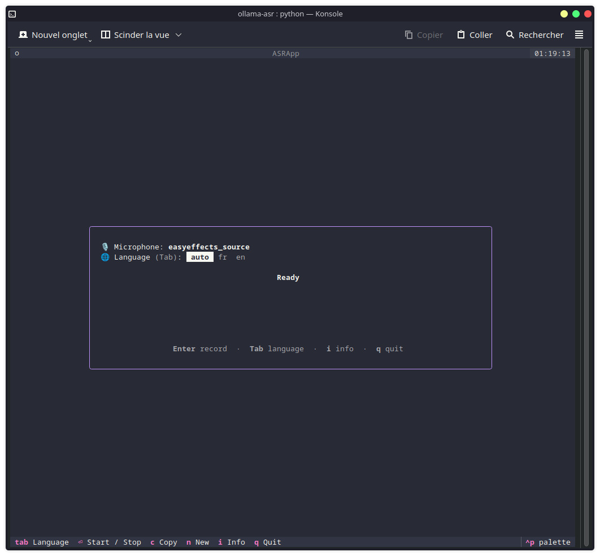
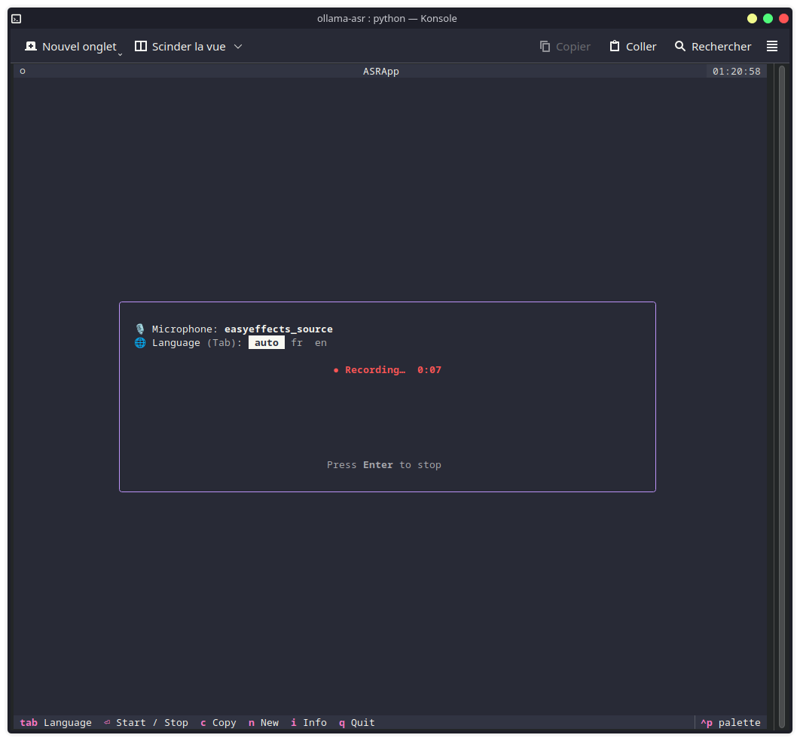

# ollama-asr

A small [Textual](https://textual.textualize.io/) TUI that records your voice from the system **default microphone**, saves it as an mp3, sends it to a local **Ollama** speech-to-text endpoint, then shows the recognized text and language and copies the text to the clipboard.

## Screenshot

Main view:
> 

Recording:
> 

Done:
> 

Show more info:
> 

## How it works

1. Reads the default mic via `pactl get-default-source`.
2. **Enter** starts recording (`ffmpeg -f pulse … libmp3lame` → mp3).
3. **Enter** again stops and uploads the mp3 to Ollama:
   `POST /v1/audio/transcriptions` (OpenAI-compatible, `multipart/form-data`).
   When a specific language is selected (see **Tab** below) it's sent as the
   optional ISO-639-1 `language` field; `auto` omits it and lets the model detect.
4. The reply (`language French<asr_text>…`) is parsed into language + text, and the
   spelled-out language name is mapped to its ISO-639-1 code (10 main languages).
5. The text is copied to the clipboard with `wl-copy`.

Press **Tab** to cycle the transcription language through `auto` and every code in
`LANGUAGES` (e.g. `auto → fr → en → auto`).

## Requirements

System packages (install with your distro's package manager):

- `ffmpeg` (with `libmp3lame` + `pulse` input)
- `pulseaudio-utils` / `pipewire-pulse` for `pactl`
- `wl-clipboard` for `wl-copy`

On Fedora/Nobara:

```sh
sudo dnf install wl-clipboard ffmpeg pulseaudio-utils
```

## Usage

```sh
./run.sh
```

## Configuration

Settings are read from a `.env` next to the script (see `.env.example`); real shell
environment variables override it.

| Variable           | Default                                          | Notes                                            |
| ------------------ | ------------------------------------------------ | ------------------------------------------------ |
| `OLLAMA_URL`       | `http://localhost:11434/v1/audio/transcriptions` | Transcription endpoint                           |
| `OLLAMA_API_KEY`   | `ollama`                                         | Sent as `Authorization: Bearer …`                |
| `OLLAMA_MODEL`     | `hf.co/ggml-org/Qwen3-ASR-1.7B-GGUF:Q8_0`        | ASR model                                        |
| `LANGUAGES`        | _(empty)_                                        | ISO-639-1 codes, comma-separated, e.g. `fr,en`   |
| `OLLAMA_ASR_FILE`  | `~/.cache/ollama-asr/recording.mp3`              | Where the recording is written                   |

## License

See LICENSE file in `./LICENSE`, Project under MIT.

