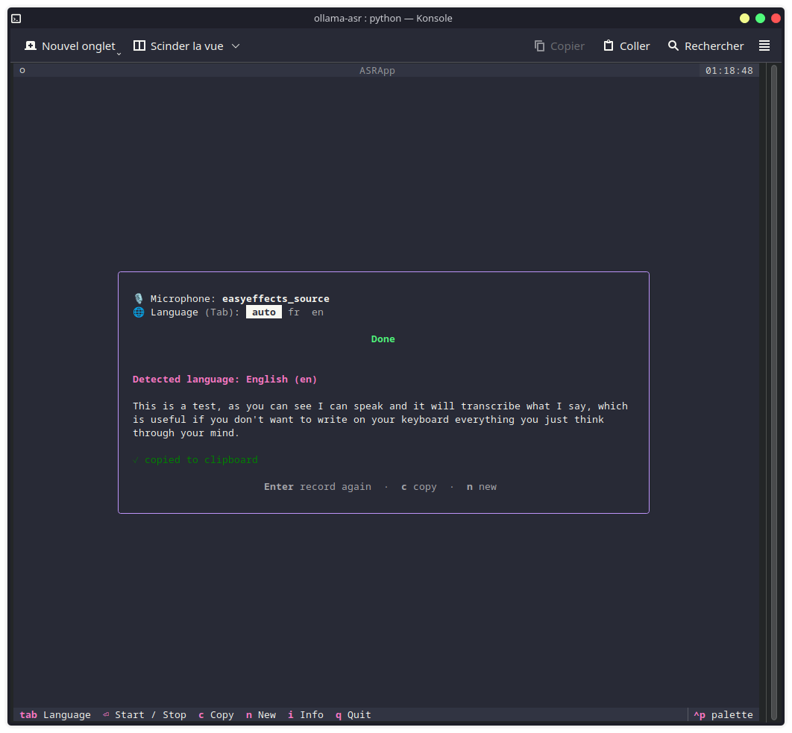
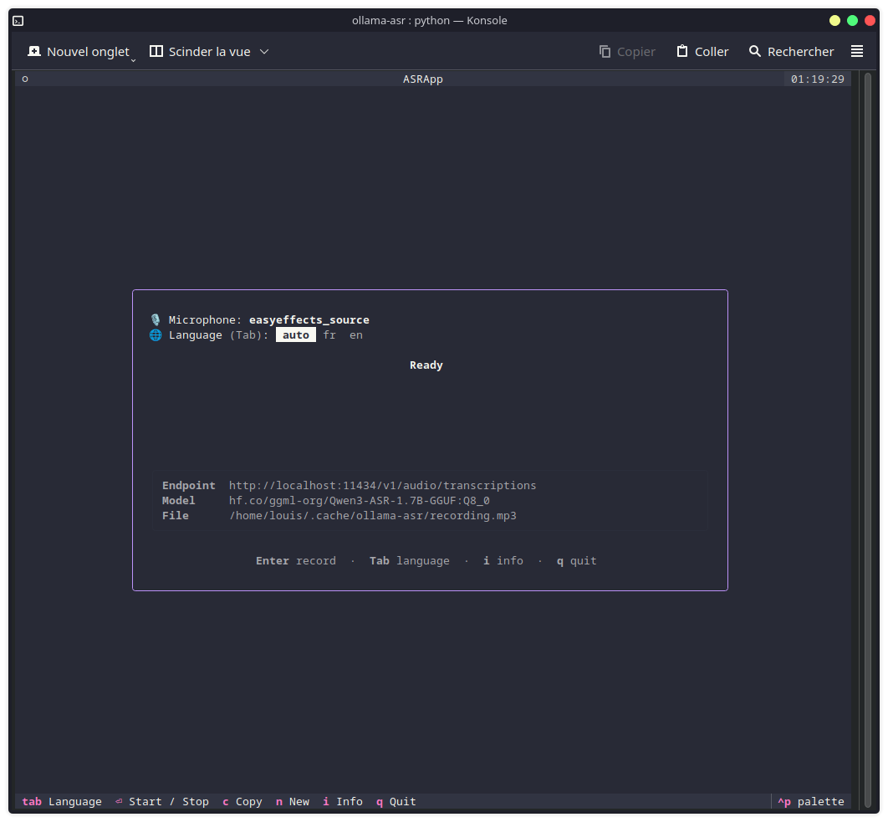

# ollama-asr

A small [Textual](https://textual.textualize.io/) TUI that records your voice from the system **default microphone**, saves it as an mp3, sends it to a local **Ollama** speech-to-text endpoint, then shows the recognized text and language and copies the text to the clipboard.

## Screenshot

Main view:
> 

Recording:
> 

Done:
> 

Show more info:
> 

## How it works

1. Reads the default mic via `pactl get-default-source`.
2. **Enter** starts recording (`ffmpeg -f pulse … libmp3lame` → mp3).
3. **Enter** again stops and uploads the mp3 to Ollama: `POST /v1/audio/transcriptions` (OpenAI-compatible, `multipart/form-data`). When a specific language is selected (see **Tab** below) it's sent as the optional ISO-639-1 `language` field; `auto` omits it and lets the model detect.
4. The reply (`language French<asr_text>…`) is parsed into language + text, and the spelled-out language name is mapped to its ISO-639-1 code (10 main languages).
5. The text is copied to the clipboard via whichever of `wl-copy`, `xclip`, or `xsel` is installed — Wayland and X11 are both supported.

Press **Tab** to cycle the transcription language through `auto` and every code in `LANGUAGES` (e.g. `auto → fr → en → auto`).

## Requirements

System packages (install with your distro's package manager). All are required except **at least one** of the clipboard tools — pick whichever matches your desktop session:

- `ffmpeg` (with `libmp3lame` + `pulse` input)
- `pulseaudio-utils` / `pipewire-pulse` for `pactl`
- **one** of: `wl-clipboard` (*Wayland*), `xclip`, or `xsel` (*X11*)

On Fedora/Nobara:

```sh
# X11:
sudo dnf install xclip ffmpeg pulseaudio-utils
# Wayland:
sudo dnf install wl-clipboard ffmpeg pulseaudio-utils
```

On Debian/Ubuntu:

```sh
# X11 (xsel also works):
sudo apt install xclip ffmpeg
# Wayland:
sudo apt install wl-clipboard ffmpeg
```

## Usage

```sh
./run.sh
```

## Configuration

Settings are read from a `.env` next to the script (see `.env.example`); real shell environment variables override it.

| Variable           | Default                                          | Notes                                            |
| ------------------ | ------------------------------------------------ | ------------------------------------------------ |
| `OLLAMA_URL`       | `http://localhost:11434/v1/audio/transcriptions` | [Transcription endpoint](https://developers.openai.com/api/reference/resources/audio/subresources/transcriptions/methods/create)                |
| `OLLAMA_API_KEY`   | `ollama`                                         | Sent as `Authorization: Bearer …`                |
| `OLLAMA_MODEL`     | `hf.co/ggml-org/Qwen3-ASR-1.7B-GGUF:Q8_0`        | ASR model                                        |
| `LANGUAGES`        | _(empty)_                                        | ISO-639-1 codes, comma-separated, e.g. `fr,en`   |
| `OLLAMA_ASR_FILE`  | `~/.cache/ollama-asr/recording.mp3`              | Where the recording is written                   |
| `SHORTCUT_RECORD_HINT` | _(empty)_                                    | Label for the global start/stop shortcut; its presence enables the listener (see below) |
| `OLLAMA_ASR_MAX_REC`   | `300`                                        | Maximum recording duration in seconds before auto-stop. `0` or blank disables. Guard against accidentally recording for hours. |

## Global start/stop shortcut

You can start/stop recording with a key combo even when the app is unfocused or minimized. The key is bound in your **desktop settings** and runs a command that launches the app (if needed) and signals it over a Unix socket:

1. Set `SHORTCUT_RECORD_HINT` in your `.env` to the key combo you plan to bind. The value is **only a label**, so this string is just shown in the UI to remind you what you wired up:

   ```sh
   SHORTCUT_RECORD_HINT=Meta+R
   ```

   Its presence also enables the listener thread on startup. Leave it blank to disable the feature (no thread, no socket).

2. Bind a global shortcut to run `/path/to/script/run.sh --toggle`:

   - **KDE Plasma**: *System Settings → Keyboard → Shortcuts → Add Command or
     Script*. Set the command to:

     ```sh
     /path/to/ollama-asr/run.sh --toggle
     ```

     then assign your trigger (e.g. `Meta+R`).
   - **GNOME**: *Settings → Keyboard → Custom Shortcuts* → add the same command.

`run.sh --toggle` is the all-in-one binding:
- if the app is already running it toggles recording (first press starts, next press stops and transcribes — like pressing **Enter** in the TUI);
- if it isn't, it opens the TUI in a detected terminal emulator (kitty, alacritty, foot, konsole, gnome-terminal, …) and starts recording immediately.

The control socket lives at `$XDG_RUNTIME_DIR/ollama-asr.sock`.

## Running Ollama on another machine

By default the app talks to Ollama on `localhost`. To run the app while Ollama runs on another, point `OLLAMA_URL` at the server's address (open-AI compatible):

```sh
OLLAMA_URL=http://192.168.1.50:11434
```

Ollama must listen on all interfaces instead of `localhost`. If on systemd, edit `/etc/systemd/system/ollama.service` and add an `Environment` line under `[Service]`:

```ini
[Service]
Environment="OLLAMA_HOST=0.0.0.0:11434"
```

Then reload and restart:

```sh
sudo systemctl daemon-reload
sudo systemctl restart ollama
```

### Security aspect

The audio file and the transcribed text are sent over the network; If `OLLAMA_URL` is `localhost` then nothing leaves your computer.

Mic is listening only when the app says it's recording.

On the Ollama server, make sure your ASR model is pulled locally. OpenAI and likes are known to sell/train on what you give them.

### Firewall

If you have a firewall, you need to open the port `11434`. (if the client's app can't reach ollama, it's likely because of this.)

With **firewalld**:

```sh
sudo firewall-cmd --add-port=11434/tcp --permanent && sudo firewall-cmd --reload
```

With **ufw**:

```sh
sudo ufw allow 11434/tcp
```

Verify from the client: `curl http://192.168.1.50:11434/api/tags` should list the server's models.

> ⚠️ **Trusted networks only.** Binding to `0.0.0.0` exposes Ollama unauthenticated to everyone who can reach the port. Only do this on a trusted local network.
>
> To be stricter, restrict the firewall rule to the client's IP instead of opening the port to everyone (client's IP eq.: `192.168.1.10`):
>
> ```sh
> # firewalld
> sudo firewall-cmd --add-rich-rule='rule family="ipv4" source address="192.168.1.10" port port="11434" protocol="tcp" accept' --permanent && sudo firewall-cmd --reload
> # ufw
> sudo ufw allow from 192.168.1.10 to any port 11434 proto tcp
> ```

## License

See LICENSE file in `./LICENSE`, this project is under MIT.
